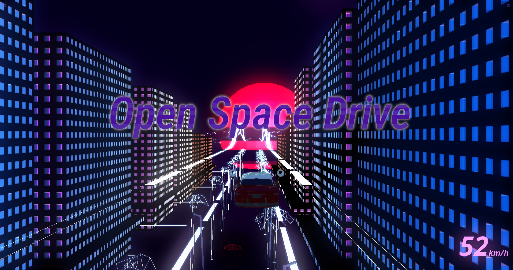

# Open Space Drive

# Running

Simply run:

    cd code
    python3 main.py

# Controls

Key mappings:

    w             Forward
    s             Backward
    shift         Boost
    q             Up
    e             Down
    space         Slow down
    a             Turn left
    d             Turn right
    arrow_up      Head down
    arrow_down    Head up
    arrow_left    Roll left
    arrow_right   Roll right
    f5            Refresh
    enter         Place asset
    escape        Quit asset placing mode

# Creating a new asset

To get you started, copy the asset template folder:

    cp asset_template assets/my_new_asset_name

This includes the .blend file, an exported .dae file (collada) and the python class for your new asset.

Edit your model in blender and re-export the dae with blender's exporter. (Don't forget to apply any modifiers)

To update the asset list and generate the previews, run:

    python3 BuildAssets.py
